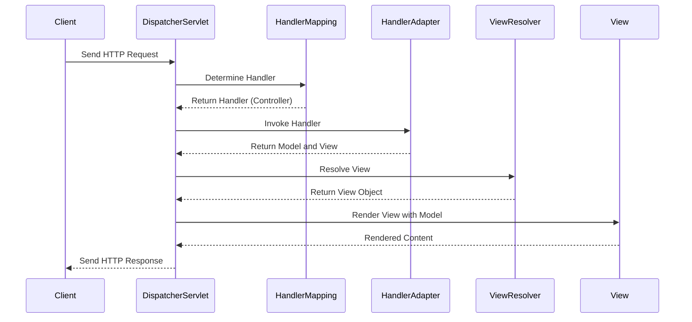
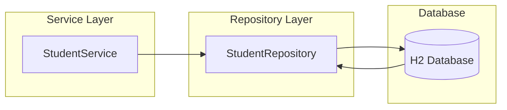
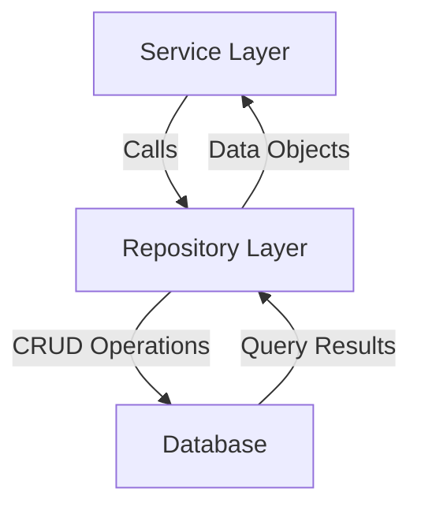
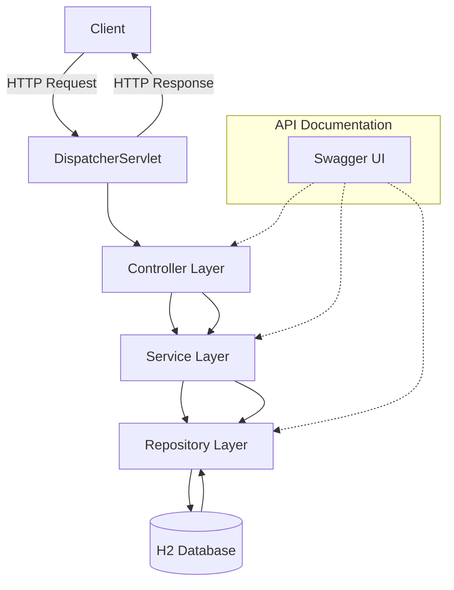
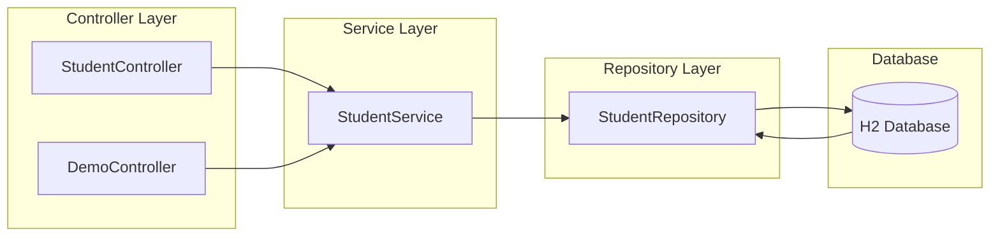
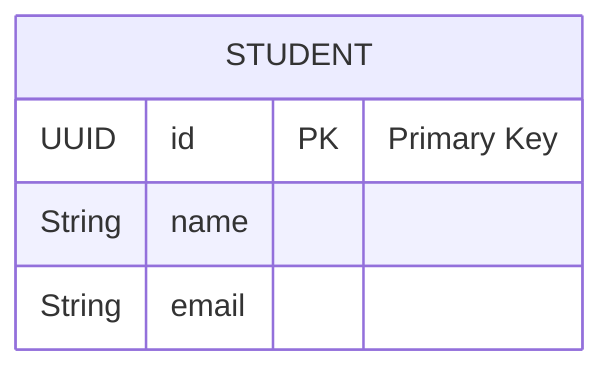

# Demo Spring Boot Application with MVC Repository Pattern

## Table of Contents

1. [Introduction](#introduction)
2. [Project Structure](#project-structure)
3. [Architecture Overview](#architecture-overview)
4. [DispatcherServlet](#dispatcherservlet)
5. [Controller Layer](#controller-layer)
6. [Service Layer](#service-layer)
7. [Repository Layer](#repository-layer)
8. [Database Integration](#database-integration)
9. [API Documentation with Swagger](#api-documentation-with-swagger)
10. [Running the Application](#running-the-application)
11. [Diagrams](#diagrams)
12. [Conclusion](#conclusion)

---

## Introduction

Welcome to the **Demo Spring Boot Application**, a comprehensive example showcasing the **MVC (Model-View-Controller) Repository Pattern** integrated with **CRUD (Create, Read, Update, Delete)** operations, **Swagger** for API documentation, and an **H2 in-memory database** for data persistence. This project serves as an educational tool to understand the architectural components and their interactions within a Spring Boot application.

---

## Project Structure

The project follows a standard Maven-based Spring Boot structure:

```
demo/
├── .mvn/
│   └── wrapper/
│       └── maven-wrapper.properties
├── src/
│   ├── main/
│   │   ├── java/
│   │   │   └── com/
│   │   │       └── example/
│   │   │           └── demo/
│   │   │               ├── controller/
│   │   │               │   ├── DemoController.java
│   │   │               │   └── StudentController.java
│   │   │               ├── entity/
│   │   │               │   └── Student.java
│   │   │               ├── repository/
│   │   │               │   └── StudentRepository.java
│   │   │               ├── service/
│   │   │               │   └── StudentService.java
│   │   │               └── DemoApplication.java
│   │   └── resources/
│   │       └── application.yml
│   └── test/
├── data/
│   ├── demo-db.mv.db
│   └── demo-db.trace.db
├── .gitignore
├── docker-compose.yml
├── Dockerfile
├── mvnw
├── mvnw.cmd
├── pom.xml
└── README.md
```

---

## Architecture Overview

The application follows the **MVC (Model-View-Controller)** architecture combined with the **Repository Pattern** to separate concerns and promote maintainability. Here's a high-level overview of the components and their interactions:

1. **Client**: The end-user or external system interacting with the application via HTTP requests.
2. **DispatcherServlet**: Acts as the **Front Controller**, routing incoming requests to the appropriate controllers.
3. **Controller Layer**: Handles HTTP requests, invokes the **Service Layer**, and returns HTTP responses.
4. **Service Layer**: Contains business logic and interacts with the **Repository Layer** to perform CRUD operations.
5. **Repository Layer**: Interfaces with the **Database** using Spring Data JPA to manage data persistence.
6. **Database**: Stores application data (using H2 in-memory database in this case).
7. **Swagger UI**: Provides interactive API documentation for testing and exploring endpoints.

---

## DispatcherServlet

### Overview

The `DispatcherServlet` is the core component of Spring's MVC framework. It acts as the **Front Controller**, intercepting all incoming HTTP requests and delegating them to the appropriate handlers (controllers).

### Responsibilities

- **Request Routing**: Determines which controller should handle an incoming request based on URL patterns.
- **Handler Mapping**: Utilizes `HandlerMapping` to map requests to controllers.
- **View Resolution**: Resolves view names to actual view implementations (e.g., Thymeleaf, JSP).
- **Exception Handling**: Manages exceptions thrown during request processing.

### Interaction Flow

1. **Client Request**: The client sends an HTTP request to the application.
2. **DispatcherServlet Receives Request**: Acts as the entry point for all HTTP requests.
3. **Handler Mapping**: Determines the appropriate controller based on the request URL.
4. **Controller Invocation**: Delegates the request to the selected controller.
5. **Service Interaction**: The controller interacts with the service layer to process data.
6. **View Resolution**: The `DispatcherServlet` uses `ViewResolver` to determine the correct view.
7. **Response Rendering**: Renders the view with the model data and sends the HTTP response back to the client.

### Diagram



---

## Controller Layer

### Overview

The **Controller Layer** is responsible for handling incoming HTTP requests, interacting with the **Service Layer** to process data, and returning appropriate HTTP responses. It serves as the bridge between the client and the application's business logic.

### Key Components

- **`StudentController.java`**: Manages CRUD operations for students.
- **`DemoController.java`**: Provides demo endpoints for educational purposes.

### `StudentController.java`

```java
package com.example.demo.controller;

import com.example.demo.entity.Student;
import com.example.demo.service.StudentService;
import io.swagger.v3.oas.annotations.Operation;
import io.swagger.v3.oas.annotations.tags.Tag;
import io.swagger.v3.oas.annotations.Parameter;
import io.swagger.v3.oas.annotations.responses.ApiResponse;
import io.swagger.v3.oas.annotations.responses.ApiResponses;
import org.springframework.beans.factory.annotation.Autowired;
import org.springframework.web.bind.annotation.*;

import java.util.List;
import java.util.UUID;

@RestController
@RequestMapping("/api/students")
@Tag(name = "Student Controller", description = "CRUD operations for Students")
public class StudentController {

    @Autowired
    private StudentService studentService;

    @Operation(summary = "Get All Students", description = "Retrieve a list of all students")
    @ApiResponse(responseCode = "200", description = "Successfully retrieved list")
    @GetMapping
    public List<Student> getAllStudents() {
        return studentService.getAllStudents();
    }

    @Operation(summary = "Create Student", description = "Create a new student")
    @ApiResponses(value = {
        @ApiResponse(responseCode = "201", description = "Student created successfully"),
        @ApiResponse(responseCode = "400", description = "Invalid input")
    })
    @PostMapping
    public Student createStudent(
            @Parameter(description = "Student object to be created", required = true)
            @RequestBody Student student) {
        return studentService.createStudent(student);
    }

    @Operation(summary = "Get Student by ID", description = "Retrieve a student by their ID")
    @ApiResponses(value = {
        @ApiResponse(responseCode = "200", description = "Successfully retrieved student"),
        @ApiResponse(responseCode = "404", description = "Student not found")
    })
    @GetMapping("/{id}")
    public Student getStudentById(
            @Parameter(description = "UUID of the student to retrieve", required = true)
            @PathVariable UUID id) {
        return studentService.getStudentById(id);
    }

    @Operation(summary = "Delete Student", description = "Delete a student by their ID")
    @ApiResponses(value = {
        @ApiResponse(responseCode = "204", description = "Student deleted successfully"),
        @ApiResponse(responseCode = "404", description = "Student not found")
    })
    @DeleteMapping("/{id}")
    public void deleteStudent(
            @Parameter(description = "UUID of the student to delete", required = true)
            @PathVariable UUID id) {
        studentService.deleteStudent(id);
    }
}
```

### `DemoController.java`

```java
package com.example.demo.controller;

import io.swagger.v3.oas.annotations.Operation;
import io.swagger.v3.oas.annotations.Parameter;
import io.swagger.v3.oas.annotations.media.Content;
import io.swagger.v3.oas.annotations.media.Schema;
import io.swagger.v3.oas.annotations.responses.ApiResponse;
import io.swagger.v3.oas.annotations.responses.ApiResponses;
import io.swagger.v3.oas.annotations.tags.Tag;
import org.springframework.web.bind.annotation.*;

@RestController
@RequestMapping("/api/demo")
@Tag(name = "Demo Controller", description = "This is a demo controller for educational purposes")
public class DemoController {

    @Operation(summary = "Say Hello", description = "This endpoint returns a simple greeting message.")
    @ApiResponse(responseCode = "200", description = "Greeting message returned successfully")
    @GetMapping("/hello")
    public String helloWorld() {
        return "Hello, Swagger!";
    }

    @Operation(summary = "Greet User", description = "Returns a greeting message with a note in JSON format.")
    @ApiResponses(value = {
            @ApiResponse(responseCode = "200", description = "Successfully retrieved greeting message",
                    content = { @Content(mediaType = "application/json",
                            schema = @Schema(implementation = Greeting.class)) }),
            @ApiResponse(responseCode = "500", description = "Internal server error")
    })
    @GetMapping("/greet")
    public Greeting greetUser() {
        return new Greeting("Greetings from the Demo Controller!", "Have a great day!");
    }

    @Operation(summary = "Create User", description = "Creates a new user by accepting a JSON body with name and email.")
    @ApiResponses(value = {
            @ApiResponse(responseCode = "201", description = "User created successfully",
                    content = { @Content(mediaType = "application/json",
                            schema = @Schema(implementation = User.class)) }),
            @ApiResponse(responseCode = "400", description = "Invalid input data")
    })
    @PostMapping("/createUser")
    public User createUser(
            @Parameter(description = "User object containing name and email", required = true)
            @RequestBody User user) {
        return new User(user.getName(), user.getEmail());
    }
}

// A simple POJO class to return a greeting message as JSON
class Greeting {
    private String message;
    private String note;

    public Greeting(String message, String note) {
        this.message = message;
        this.note = note;
    }

    // Getters and Setters
    public String getMessage() {
        return message;
    }

    public void setMessage(String message) {
        this.message = message;
    }

    public String getNote() {
        return note;
    }

    public void setNote(String note) {
        this.note = note;
    }
}

// A simple POJO class representing a User
class User {
    private String name;
    private String email;

    public User() {}

    public User(String name, String email) {
        this.name = name;
        this.email = email;
    }

    // Getters and Setters
    public String getName() {
        return name;
    }

    public void setName(String name) {
        this.name = name;
    }

	public String getEmail() {
        return email;
    }

    public void setEmail(String email) {
        this.email = email;
    }
}
```

### Responsibilities

- **Handling Requests**: Each controller method is mapped to a specific HTTP endpoint and method (e.g., `GET`, `POST`, `DELETE`).
- **Interacting with Services**: Controllers delegate business logic to the **Service Layer**.
- **Returning Responses**: Controllers return data objects or status codes as HTTP responses.

### Swagger Integration

- **Annotations**: Utilizes Swagger annotations (`@Operation`, `@ApiResponse`, `@Parameter`, `@Tag`) to generate interactive API documentation.
- **Endpoint Documentation**: Each controller method is well-documented, specifying request parameters, response codes, and descriptions.

---

## Service Layer

### Overview

The **Service Layer** encapsulates the application's business logic. It processes data, enforces business rules, and interacts with the **Repository Layer** to perform CRUD operations. This separation ensures that controllers remain lightweight and focused solely on handling HTTP requests and responses.

### Key Components

- **`StudentService.java`**

### `StudentService.java`

```java
package com.example.demo.service;

import com.example.demo.entity.Student;
import com.example.demo.repository.StudentRepository;
import org.springframework.beans.factory.annotation.Autowired;
import org.springframework.stereotype.Service;

import java.util.List;
import java.util.UUID;

@Service
public class StudentService {

    @Autowired
    private StudentRepository studentRepository;

    public List<Student> getAllStudents() {
        return studentRepository.findAll();
    }

    public Student createStudent(Student student) {
        return studentRepository.save(student);
    }

    public Student getStudentById(UUID id) {
        return studentRepository.findById(id).orElse(null);
    }

    public void deleteStudent(UUID id) {
        studentRepository.deleteById(id);
    }
}
```

### Responsibilities

- **Business Logic**: Implements the core functionality required by the application, such as creating, retrieving, and deleting student records.
- **Data Validation**: (Optional) Can include validation logic to ensure data integrity before interacting with the repository.
- **Transaction Management**: (Optional) Manages transactions to ensure data consistency.

### Interaction Flow

1. **Controller Invocation**: Receives method calls from controllers (e.g., `createStudent`, `getAllStudents`).
2. **Repository Interaction**: Calls repository methods to perform data access operations.
3. **Data Processing**: Processes or transforms data as needed before returning to the controller.

### Diagram



### Explanation

- **`StudentService`** interacts with **`StudentRepository`** to perform CRUD operations.
- Ensures that the **Controller Layer** does not directly interact with the **Repository Layer**, promoting separation of concerns.

---

## Repository Layer

### Overview

The **Repository Layer** is responsible for data access and persistence. It interfaces directly with the database, executing queries and managing data storage and retrieval. By leveraging **Spring Data JPA**, repositories can perform CRUD operations without the need for boilerplate code.

### Key Components

- **`StudentRepository.java`**

### `StudentRepository.java`

```java
package com.example.demo.repository;

import com.example.demo.entity.Student;
import org.springframework.data.jpa.repository.JpaRepository;
import org.springframework.stereotype.Repository;
import java.util.UUID;

@Repository
public interface StudentRepository extends JpaRepository<Student, UUID> {
}
```

### Responsibilities

- **Data Access**: Provides methods to perform CRUD operations on the `Student` entity.
- **Query Methods**: (Optional) Can define custom query methods beyond the standard CRUD operations.
- **Database Interaction**: Communicates with the database to execute SQL statements.

### Interaction Flow

1. **Service Invocation**: The **Service Layer** invokes repository methods to interact with the database.
2. **CRUD Operations**: Executes create, read, update, and delete operations on the `Student` entity.
3. **Result Handling**: Returns the results of database operations back to the **Service Layer**.

### Diagram



### Explanation

- **`StudentRepository`** extends `JpaRepository`, inheriting methods like `findAll()`, `save()`, `findById()`, and `deleteById()`.
- Spring Data JPA automatically implements these methods, reducing the need for manual SQL or JPQL queries.
- The repository interacts directly with the **H2 Database** to persist and retrieve `Student` entities.

---

## Database Integration

### Overview

The **Database** serves as the persistent storage for the application's data. In this project, an **H2 in-memory database** is used for development and testing purposes. The database schema is automatically managed by **Hibernate** based on the entity classes.

### Key Components

- **H2 Database**: An in-memory database that is lightweight and suitable for development.
- **Entity Classes**: Represent the database tables. For example, the `Student` entity maps to the `student` table.

### `Student.java`

```java
package com.example.demo.entity;

import jakarta.persistence.Entity;
import jakarta.persistence.GeneratedValue;
import jakarta.persistence.Id;
import jakarta.persistence.Column;
import org.hibernate.annotations.GenericGenerator;
import java.util.UUID;

@Entity
public class Student {

    @Id
    @GeneratedValue(generator = "UUID")
    @GenericGenerator(
        name = "UUID",
        strategy = "org.hibernate.id.UUIDGenerator"
    )
    @Column(columnDefinition = "uuid")
    private UUID id;

    private String name;
    private String email;

    // Constructors
    public Student() {}

    public Student(String name, String email) {
        this.name = name;
        this.email = email;
    }

    // Getters and Setters
    public UUID getId() {
        return id;
    }

    public void setId(UUID id) {
        this.id = id;
    }

    public String getName() {
        return name;
    }

    public void setName(String name) {
        this.name = name;
    }

	public String getEmail() {
        return email;
    }

    public void setEmail(String email) {
        this.email = email;
    }
}
```

### Responsibilities

- **Entity Mapping**: The `@Entity` annotation maps the `Student` class to the `student` table in the database.
- **Primary Key Generation**: Utilizes a UUID generator to ensure each `Student` has a unique identifier.
- **Column Definitions**: Defines the data types and constraints for each field.

### Database Configuration

The database is configured via the `application.yml` file:

```yaml
spring:
  application:
    name: demo

  datasource:
    url: jdbc:h2:file:./data/demo-db;DB_CLOSE_ON_EXIT=FALSE;AUTO_RECONNECT=TRUE
    driverClassName: org.h2.Driver
    username: sa
    password: password
    platform: h2

  h2:
    console:
      enabled: true
      path: /h2-console

  jpa:
    hibernate:
      ddl-auto: update
    show-sql: true

springdoc:
  api-docs:
    path: /api-docs
  swagger-ui:
    path: /swagger-ui.html
    operationsSorter: method
    tagsSorter: name
```

### Configuration Details

- **Datasource URL**: Specifies the H2 database file location and connection properties.
- **Driver Class Name**: `org.h2.Driver` for H2 database connectivity.
- **Username & Password**: Credentials for accessing the database.
- **H2 Console**: Enabled at `/h2-console` for direct database interaction.
- **JPA & Hibernate**:
  - `ddl-auto: update`: Automatically creates or updates the database schema based on entity classes.
  - `show-sql: true`: Logs SQL statements to the console for debugging purposes.

### Interactions

1. **Entity Creation**: When a new `Student` is created via the API, the `StudentService` calls the `StudentRepository` to save the entity.
2. **Persistence**: The repository interacts with Hibernate to generate the necessary SQL and persist the `Student` in the H2 database.
3. **Retrieval**: Fetching students involves executing SQL queries to retrieve data from the database.
4. **Deletion**: Removing a student deletes the corresponding record from the database.

---

## Repository Layer

*Note: This section seems to have been covered earlier. To avoid redundancy, I'll assume the user wants more detail.*

### Additional Details

- **Custom Query Methods**: While `JpaRepository` provides standard CRUD operations, custom query methods can be defined based on naming conventions or using the `@Query` annotation for more complex queries.

```java
// Example of a custom query method
public interface StudentRepository extends JpaRepository<Student, UUID> {
    List<Student> findByNameContaining(String name);
}
```

- **Pagination and Sorting**: `JpaRepository` supports pagination and sorting out of the box.

```java
// Example of pagination and sorting
Page<Student> findAll(Pageable pageable);
```

---

## Database Integration

*Note: The user seems to have mistakenly repeated the section. It's already covered above.*

---

## API Documentation with Swagger

### Overview

**Swagger** is integrated into the application using **SpringDoc OpenAPI**. It provides interactive API documentation, allowing developers to explore and test API endpoints directly from the browser.

### Configuration

Configured in `application.yml`:

```yaml
springdoc:
  api-docs:
    path: /api-docs
  swagger-ui:
    path: /swagger-ui.html
    operationsSorter: method
    tagsSorter: name
```

### Accessing Swagger UI

1. **Start the Application**: Ensure the Spring Boot application is running.
2. **Navigate to Swagger UI**: Open your browser and go to [http://localhost:8080/swagger-ui.html](http://localhost:8080/swagger-ui.html).
3. **Explore Endpoints**: Browse through the available API endpoints under different controllers (e.g., Student Controller, Demo Controller).
4. **Interactive Testing**: Use the "Try it out" feature to send requests and view responses directly from the UI.

### Features

- **Endpoint Descriptions**: Detailed information about each API endpoint, including summaries and descriptions.
- **Request Parameters**: Information about required and optional parameters for each endpoint.
- **Response Codes**: Documentation of possible HTTP response codes and their meanings.
- **Schema Definitions**: Visual representations of request and response models.

### Example Usage

#### Deleting a Student

1. **Locate the Endpoint**: Find the `DELETE /api/students/{id}` endpoint under the **Student Controller** section.
2. **Expand the Endpoint**: Click on the endpoint to view details.
3. **Try it out**: Click the "Try it out" button to enable input fields.
4. **Provide the Student ID**: Enter the UUID of the student you wish to delete in the `{id}` field.
5. **Execute the Request**: Click the "Execute" button to send the request.
6. **View the Response**:
   - **204 No Content**: Indicates successful deletion.
   - **404 Not Found**: Indicates that the student with the provided ID does not exist.

---

## Running the Application

### Prerequisites

- **Java Development Kit (JDK) 17** or higher.
- **Maven** installed (optional, as the project includes Maven Wrapper).
- **Git** (optional, for version control).

### Steps

1. **Clone the Repository**

   ```bash
   git clone https://github.com/yourusername/demo.git
   cd demo
   ```

2. **Build the Project**

   Using Maven Wrapper:

   ```bash
   ./mvnw clean install
   ```

   Or, if Maven is installed locally:

   ```bash
   mvn clean install
   ```

3. **Run the Application**

   Using Maven Wrapper:

   ```bash
   ./mvnw spring-boot:run
   ```

   Or, run the `DemoApplication` class from your IDE.

4. **Access the Application**

   - **Swagger UI**: [http://localhost:8080/swagger-ui.html](http://localhost:8080/swagger-ui.html)
   - **H2 Console**: [http://localhost:8080/h2-console](http://localhost:8080/h2-console)
     - **JDBC URL**: `jdbc:h2:file:./data/demo-db`
     - **Username**: `sa`
     - **Password**: `password`

### Docker Setup (Optional)

If you prefer running the application using Docker, ensure you have Docker installed and configured.

1. **Build the Docker Image**

   ```bash
   docker build -t demo-app .
   ```

2. **Run the Docker Container**

   ```bash
   docker run -p 8080:8080 demo-app
   ```

   - **Access Swagger UI**: [http://localhost:8080/swagger-ui.html](http://localhost:8080/swagger-ui.html)
   - **H2 Console**: [http://localhost:8080/h2-console](http://localhost:8080/h2-console)

---

## Diagrams

To better understand the application's architecture and component interactions, the following diagrams are provided:

### 1. High-Level Architecture Component Diagram



### 2. DispatcherServlet Diagram


### 3. Controller Layer Diagram



### 4. Service Layer Diagram


### 5. Repository Layer Diagram


### 6. Database ER Diagram



### How to Use the Diagrams

1. **Understanding Flow**: Start with the **High-Level Architecture** to grasp the overall structure.
2. **Deep Dive**: Examine each component (DispatcherServlet, Controller, Service, Repository, Database) individually using their respective diagrams.
3. **Interactive Flow**: Use the **Sequence Diagrams** to understand the step-by-step interactions during specific operations (e.g., deleting a student).
4. **Entity Relationships**: Refer to the **ER Diagram** to visualize how entities are structured within the database.

---

## Conclusion

This Demo Spring Boot Application effectively demonstrates the **MVC Repository Pattern** with comprehensive CRUD operations, seamless **database integration**, and interactive **API documentation** via **Swagger**. The detailed architecture, layered structure, and well-documented code make it an excellent example for educational purposes and architectural presentations.

Feel free to explore, modify, and extend this project to better suit your learning or presentation needs. Should you have any questions or require further assistance, don't hesitate to reach out!

---

# Quick Links

- [Swagger UI](http://localhost:8080/swagger-ui.html)
- [H2 Console](http://localhost:8080/h2-console)
- [Spring Boot Documentation](https://docs.spring.io/spring-boot/docs/current/reference/htmlsingle/)
- [Spring Data JPA Documentation](https://docs.spring.io/spring-data/jpa/docs/current/reference/html/)
- [SpringDoc OpenAPI Documentation](https://springdoc.org/)

---

# License

This project is licensed under the MIT License - see the [LICENSE](LICENSE) file for details.

# Author

Your Name - [your.email@example.com](mailto:your.email@example.com)

# Acknowledgments

- [Spring Boot](https://spring.io/projects/spring-boot)
- [Spring Data JPA](https://spring.io/projects/spring-data-jpa)
- [Swagger](https://swagger.io/)
- [H2 Database](https://www.h2database.com/html/main.html)